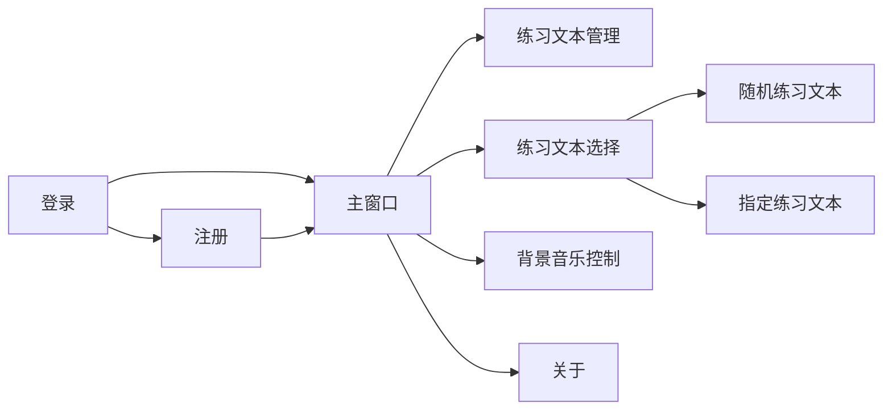
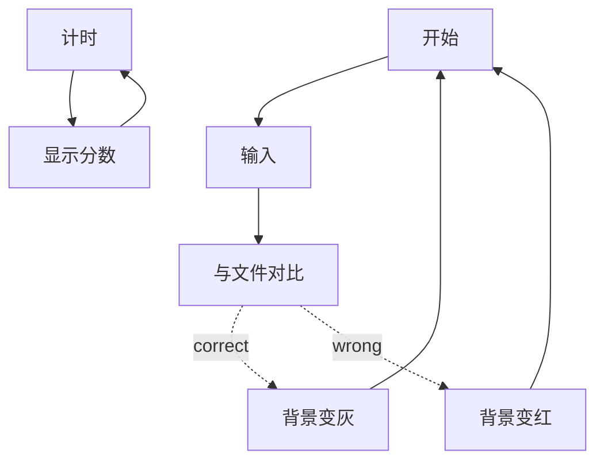

# TypeBooster
--------------
## 1.作者

## 2.程序功能及组员分工
  本程序通过调用win32 API实现了用户登录，选择文件，管理文件并进行打字练习，记录历史的功能，用户在完成打字之后会得到得分反馈并写入历史记录，历史记录最多保留五次。
### 本项目分工如下
  朱江云：用户登录界面，注册界面功能实现及用户信息验证、练习控件设计、正误判断及显示、分数计时实时显示。  
  彭枳驭：用户文件管理界面，文件选择方式实现，多媒体的实现以及用户历史记录的写入与读取，关于窗口显示。
### 程序框架图

### 数据结构
在历史记录中使用了队列的逻辑。
### 主要模块功能及工作流程图
程序功能的主要模块是文字输入与目标文本的匹配：

## 3.调试过程中的问题
if条件的判断与目的相反导致程序无法进行下去。 
在release模式下调试导致部分代码被跳过。  
对按键输入的检测发送的消息不熟悉导致误用宏。  
## 4.收获与体会
在完成课程作业的过程中，我们初步了解了git的使用，也熟练了在海量官方文档中寻找目标的能力和在网络上寻求帮助的能力，体会了windows消息机制的逻辑。
## 5.完整源程序清单
about.cpp  
about.h  
Error.cpp  
Error.h  
globle.cpp  
globle.h  
history.cpp  
history.h  
IniIO.cpp  
IniIo.h  
inputing.cpp  
inputing.h  
login.cpp  
login.h  
Main.cpp  
main.h  
mainwindow.cpp  
mainwindow.h  
manage.cpp  
manage.h  
music.cpp  
music.h  
resource.h  
select.cpp  
select.h  

